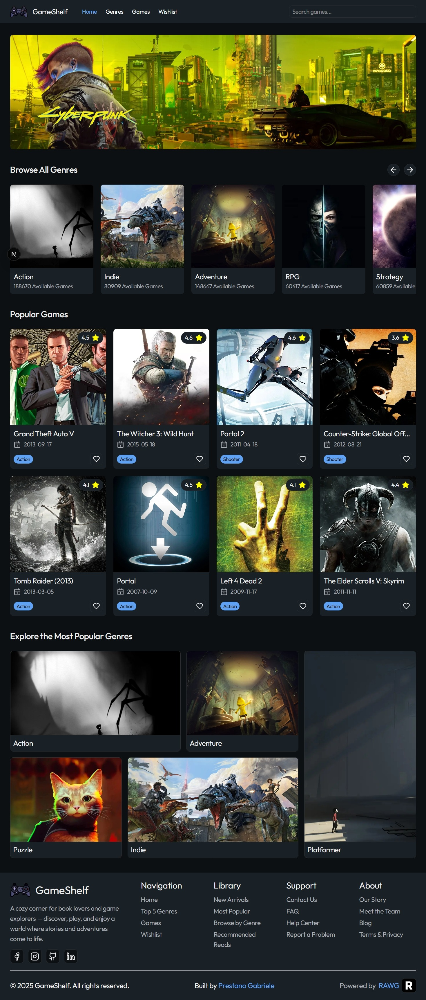
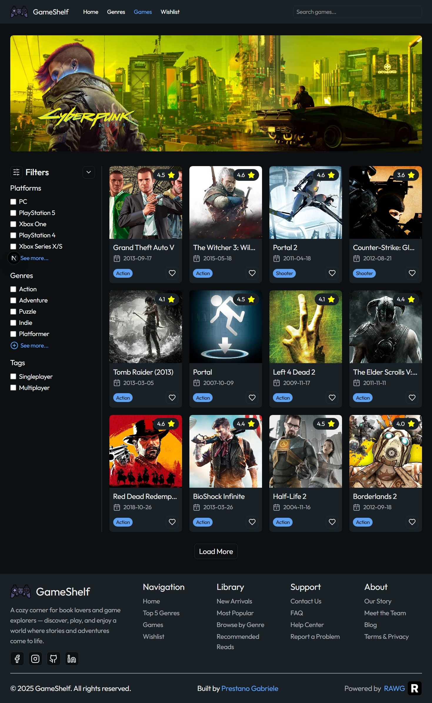
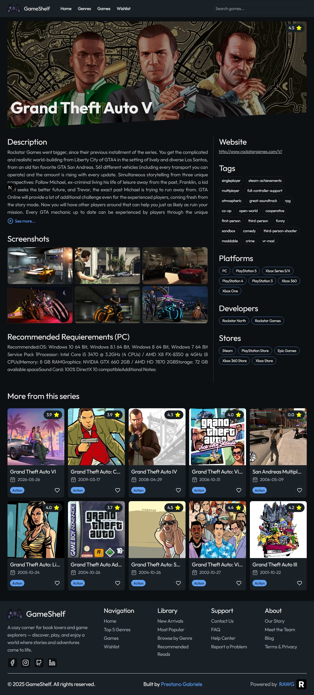

# 🎮 GameShelf

Explore and manage your favorite video games with GameShelf, a personal project powered by the RAWG API. Discover new titles, filter by genre, platform, and more!

---

## 🚀 Features

- 🔄 Dynamic routing with Next.js  
- 🔍 Search functionality using `useSearchParams` from Next.js  
- 🎛️ Filters implemented in the `lib/` folder for efficient fetching based on selected criteria  
- 📱 Fully responsive design for optimal experience across devices  
- ⚛️ State management using Redux Toolkit for scalable and maintainable state handling  

---

## 🛠️ Tech Stack

- **React**
- **TypeScript**
- **TailwindCSS**
- **Redux Toolkit**

---

## 📸 Screenshots

